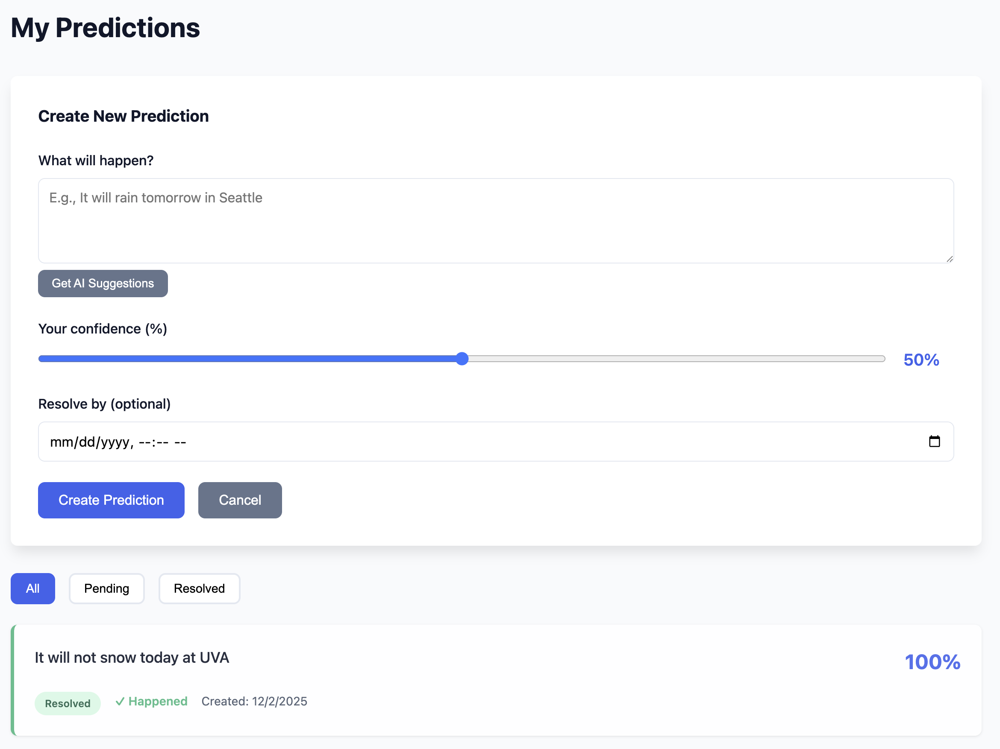
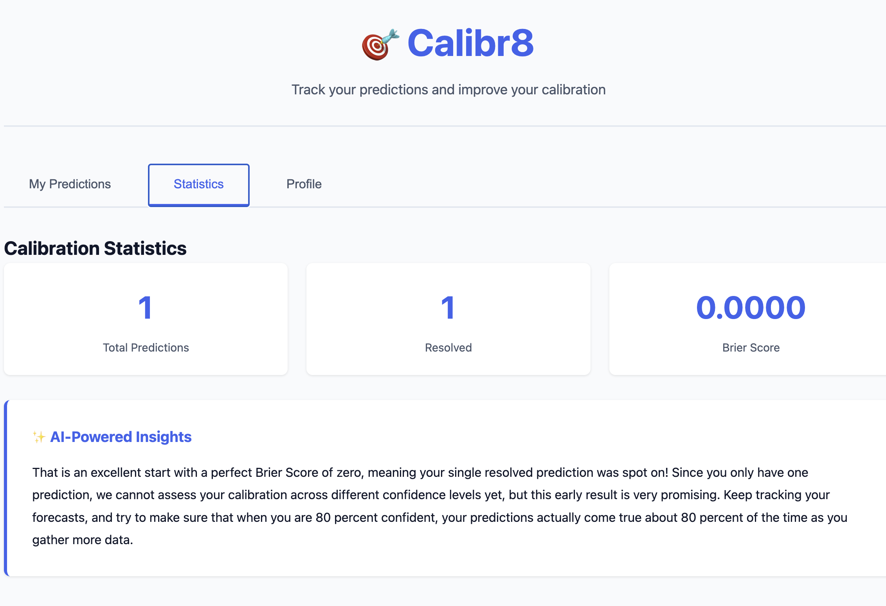

# 🎯 Calibr8: Prediction Tracking & Calibration Analysis

A full-stack web application for tracking predictions and improving calibration using Django REST Framework, Google Gemini AI, and javascript, css frontend. Deployed on Azure with full containerization support.

---

## 1) Executive Summary

### Problem
A few weeks ago I had watched a video on how people make predictions constantly in daily life and professional settings, but rarely track their accuracy or learn from their mistakes. This leads to overconfidence, poor decision-making, and a lack of awareness. I wanted a way to track my own predictions, see how well-calibrated I am, and get insights on how to improve.

### Solution
Calibr8 is a web-based prediction tracking platform that allows users to:
- Record predictions with confidence levels (0-100%)
- Mark predictions as resolved with actual outcomes
- Analyze calibration quality through Brier scores and visual calibration charts
- Track historical performance and identify areas for improvement

The system provides immediate feedback on calibration quality, helping users become better forecasters through quantitative analysis and personalized AI recommendations.

---

## 2) System Overview

### Course Concepts

This project demonstrates multiple concepts from the course:

**Version Control with Git** - Git workflow with commits, branches, and GitHub integration.

**Scripting & Environments** - Environment variables via `.env` files, virtual environments, automated startup scripts.

**APIs** - Django REST Framework API with ViewSets for CRUD, custom actions for Brier scores and prediction resolution, external Gemini API integration.

**Containers** - Dockerized with single Dockerfile for reproducible builds.

**Cloud Deployment (Azure)** - Azure App Service with GitHub Actions CI/CD for automatic deployments.

**CI/CD Pipeline** - GitHub Actions workflow deploys to Azure on push to main.

### Architecture Diagram


**Architecture Overview:**
Standard web API architecture. JavaScript frontend makes HTTP requests to Django REST API backend. SQLite handles persistence, Gemini provides AI insights. API manages predictions, calculates Brier scores, and generates AI suggestions.

### Data Models & Services

**Models:**
- `Prediction`: UUID primary key, description (text), probability (0.0-1.0), timestamps, optional resolve_by date, resolved status, outcome boolean
- `UserProfile`: Name and notes fields for user customization

**External Services:**
- Google Gemini API (gemini-2.5-flash-lite-preview-09-2025) for AI insights
- No external datasets - all user-generated data

---

## 3) How to Run (Local)

### Prerequisites
- Docker installed OR Python 3.13+
- Google Gemini API key ([Get one here](https://makersuite.google.com/app/apikey))

### Option 1: Docker (Recommended)

```bash
# Clone repository
git clone https://github.com/lhakso/calibr8.git
cd calibr8

# Set your Gemini API key
export GEMINI_API_KEY="your-api-key-here"

# Build and run
docker build -t calibr8-app .
docker run --rm -p 8000:8000 \
  -e DEBUG="True" \
  -e GEMINI_API_KEY="${GEMINI_API_KEY}" \
  calibr8-app

# Access the app
open http://localhost:8000
```

### Option 2: Using run.sh

```bash
# Make sure script is executable
chmod +x run.sh

# Set API key
export GEMINI_API_KEY="your-api-key-here"

# Run (automatically detects Docker or falls back to Python)
./run.sh
```

### Option 3: Python Virtual Environment

```bash
# Create and activate virtual environment
python -m venv .venv
source .venv/bin/activate  # On Windows: .venv\Scripts\activate

# Install dependencies
pip install -r requirements.txt

# Set up environment
cp .env.example .env
# Edit .env and add your GEMINI_API_KEY

# Run migrations
python manage.py migrate

# Start server
python manage.py runserver

# Access at http://localhost:8000
```

### Health Check

```bash
# Test API endpoints
curl http://localhost:8000/api/predictions/
curl http://localhost:8000/api/profile/

# Run automated tests
cd tests
pip install -r requirements.txt
python test_api.py
```

---

## 4) Design Decisions

### Why These Choices?

**Django** - I've built multiple Django apps already, so I'm comfortable with it. DRF makes REST APIs really easy.

**Gemini** - Better free tier than OpenAI. Works well for this kind of analytical task.

**Vanilla JS** - Didn't need React for something this small. Keeps it simple.

**Docker** - Makes deployment consistent. Same container works locally and in production.

**SQLite** - Simple for single-user deployment. No separate database server to manage. Data resets on Azure restart are acceptable for this demo/personal use case.

### Alternatives Considered

**Vue.js Frontend** - Considered for reactive state management but rejected as unnecessarily complex. Vanilla JS is sufficient.

**Self-Hosted LLM** - Looked at running Llama on the cloud instance. Gemini is free, easier, and better performance without GPU overhead.

### Tradeoffs

**Performance** - SQLite works fine for single-user but wouldn't scale for production multi-user.

**Complexity** - Kept it simple - no advanced features.

**Cost** - Azure App Service runs about $25/month on the B1 tier.

### Security

**Input Validation:**
- Description: 10-500 chars, required
- Probability: 0.0-1.0 range
- Resolve dates: future only
- DRF serializers validate all inputs

**API Security:**
- API keys in environment variables (`.env.example` template)
- Secrets never committed
- CSRF protection enabled
- DRF built-in protections

**Data Privacy:**
- Gemini processes predictions (Google privacy policy applies)
- Single-user, no auth required
- SQLite stored locally

### Limitations

- No real-time updates
- Single timezone (UTC)
- SQLite data on Azure resets when the app restarts

---

## 5) Results & Evaluation

### What Works

- Create predictions with confidence sliders (0-100%)
- AI-generated prediction ideas that understand appropriate difficulty and avoid repeating past topics
- Click predictions to resolve them (happened/didn't happen)
- View Brier score and calibration charts analyzing accuracy
- AI-powered insights explaining calibration performance and suggesting improvements

### Screenshots

**Home Page:**

*Prediction list with filter options (All/Pending/Resolved). Cards show description, confidence, date, and status. Click to resolve.*

**Statistics Page:**

*Brier score, calibration chart, and AI insights. Chart compares predicted vs. actual outcomes across confidence ranges.*
### Performance

- Container: ~450MB, builds in 2-3 minutes
- API responses: <100ms
- AI insights: 1-3 seconds
- Handles hundreds of predictions fine

### Testing

Automated tests cover creating, resolving, stats, and profile management. All CRUD operations tested. Manually tested on Chrome.

---

## 6) What's Next

**Features I'd like to add:**
- Data export (JSON/CSV)
- Prediction categories and tags
- Historical performance graphs
- Email reminders for unresolved predictions

**Technical improvements:**
- Authentication for multi-user support
- Rate limiting on AI endpoints
- Redis for caching stats
- Automated database backups
- PostgreSQL migration for production

---

## 7) Links (Required)

- **GitHub Repository:** https://github.com/lhakso/calibr8
- **Public Cloud App:** https://calibr8-app.azurewebsites.net

---

## License & Credits

MIT License. Uses Django REST Framework (BSD), Google Generative AI (Apache 2.0), and vanilla JavaScript.
